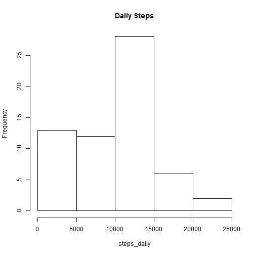
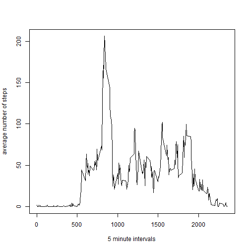
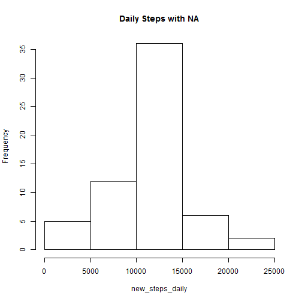
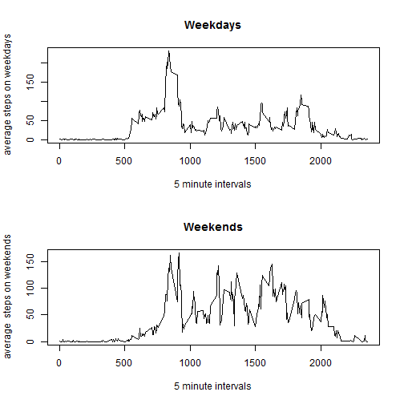

# Introduction
This is the markdown file for the code solving the first peer assingment in the Reproducible Research Course.
The purpose was to do some data analysis on a sample data, use that analysis to answer some questions, and to use markdown to annotate the code with which the analysis was done.

----------------------------------------------------------------

# Data
Data was downloaded from the course website:

* [Activity monitoring data](https://d396qusza40orc.cloudfront.net/repdata%2Fdata%2Factivity.zip)

The variables included in this dataset are:

* **steps** : Number of steps taken in the 5 minute interval
* **date**  : The date of the measurement
* **interval**: The 5 minute intervals in which the steps were measured

Once downloaded, the data was put manually into the working directory and unzipped.

----------------------------------------------------------------

# Loading and preprocessing the data
The first thing is of course to read the data into r. The following code segment does exactly that.


```r
setwd('E:/FER_posao/Coursera_Iversity/Data Scientist Specialization/5 Reproducible research/Peer assigment 1')
dt <- read.csv("activity.csv")
```

Firstly the working directory is set to directory where unzipped data is located. Next we read the data with the read.csv function.

----------------------------------------------------------------

# What is the mean total steps taken per day?
The first question concerning the data asks us to calculate the total number steps per day, draw a histogram and then to calculate and report the mean and median of steps.
The following code chunk serves the purpose.

```r
steps_daily <- tapply(dt$steps,dt$date,sum,na.rm='true')
hist(steps_daily,main = 'Daily Steps')
```

 

```r
steps_daily_mean <- mean(steps_daily)
steps_daily_median <- median(steps_daily)
steps_daily_mean
```

```
## [1] 9354.23
```

```r
steps_daily_median
```

```
## [1] 10395
```

Firstly, we use the tapply function to calculate the sum of steps per day (we have to note here that we discarded  the unknown(or NA) values in the calculation)
Then we use the hist() function to draw a histogram.
And lastly we calculate the mean and median of the daily steps.

---------------------------------------------------------------

# What is the average daily activity pattern?
The next thing is to make a plot of the average steps per interval per day, and find the interval with maximum average steps.
The following code chunk serves that purpose.

```r
steps_by_interval <- aggregate(steps ~ interval,dt,mean)
plot(steps_by_interval$interval,steps_by_interval$steps,type="l",xlab="5 minute intervals",ylab="average number of steps")
```

 

```r
max_steps_by_interval <- steps_by_interval[which.max(steps_by_interval$steps),]
```

We see here that one of the relatively painless ways to do that is to use the aggregate() function. The key is to use the steps ~ interval relation in order to specify that we want to use the mean function to get the average value of steps by intervals.
Then we can easily plot the results.
The last part is to answer which interval has the maximum average value. We use which.max function, which returns the indice of the maximum value of the variable, and subset the whole row from our wanted variable.

---------------------------------------------------

# Imputing missing values?

Untill now we have disregarded the missing values from our dataset. In this part we will restore those missing values in one way or another and then repeat the calculations with the dataset as a whole.

The first thing is to see how many missing values there are.


```r
NA_number <- sum(is.na(dt$steps))
NA_number
```

```
## [1] 2304
```

Next we have to chose in which way we want to replace those missing values.
I decided to replace all NA values with the average value for that interval.


```r
new_dt <- dt
new_dt$steps <-replace(new_dt$steps,is.na(new_dt$steps),steps_by_interval$steps)
```

Now we have our new, completed dataset, and can perform the analysis once again.


```r
new_steps_daily <- tapply(new_dt$steps,new_dt$date,sum,na.rm='true')
hist(new_steps_daily,main = 'Daily Steps with NA')
```

 

```r
new_steps_daily_mean <- mean(new_steps_daily)
new_steps_daily_median <- median(new_steps_daily)
```

Comparing the first and second histagram we can see how much adding the missing values altered the final result.

------------------------------------------------------------------------

# Are there differences in activity patterns between weekdays and weekends?
The last question remaining is to analyze and plot the difference between the average steps per interval on weekday and weekend.
Firstly, we need to divide the data based on the fact whether a day is a weekday or a weekend

```r
library(timeDate)
```

```
## Warning: package 'timeDate' was built under R version 3.2.2
```

```r
weekdays <- isWeekday(new_dt$date)
new_dt_weekdays <- new_dt[weekdays,]
new_dt_weekends <- new_dt[!weekdays,]
```
We used the isWeekday() function from the timeDate package which allows us to get the logical vector which tells us whether a date is a weekday or not.
Then we use that vector to subset our starting dataframe and get two separate dataframes.
Now we have everything ready, and can easily finish the analysis:

```r
steps_by_interval_weekdays <- aggregate(steps ~ interval,new_dt_weekdays,mean)
steps_by_interval_weekends <- aggregate(steps ~ interval,new_dt_weekends,mean)
par(mfrow=c(2,1))
plot(steps_by_interval_weekdays$interval,steps_by_interval_weekdays$steps,type="l",xlab="5 minute intervals",ylab="average steps on weekdays")
title("Weekdays")
plot(steps_by_interval_weekends$interval,steps_by_interval_weekends$steps,type="l",xlab="5 minute intervals",ylab="average  steps on weekends")
title("Weekends")
```

 

We notice that there is much greater activity on weekends, which is kinda expected since people generally have much more free time on weekend.

**Notice to the evaluators: I know that this isn't the strict panel plot using the lattice ploting system that was maybe expected, but i found it much easier to split the data using isWeekday, then to try something else.**
